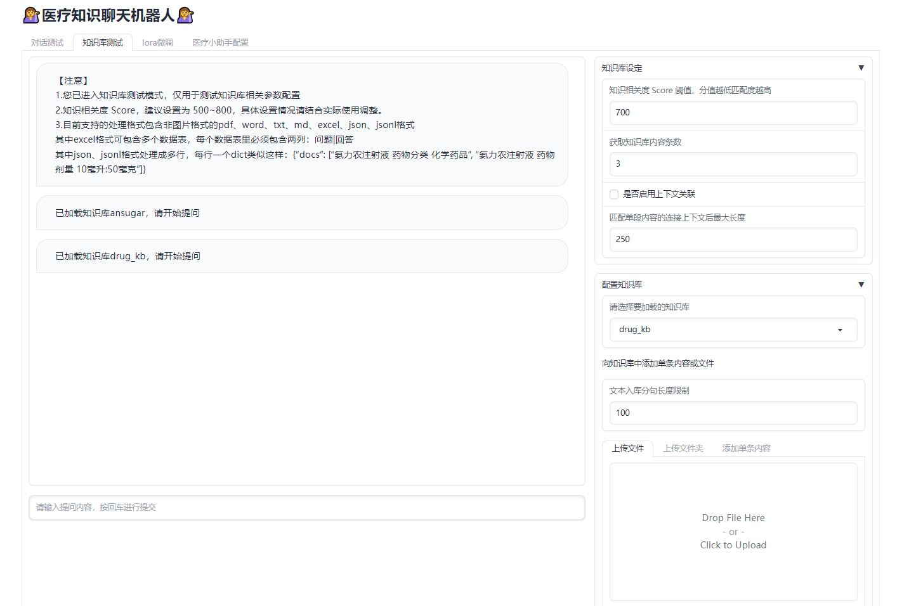
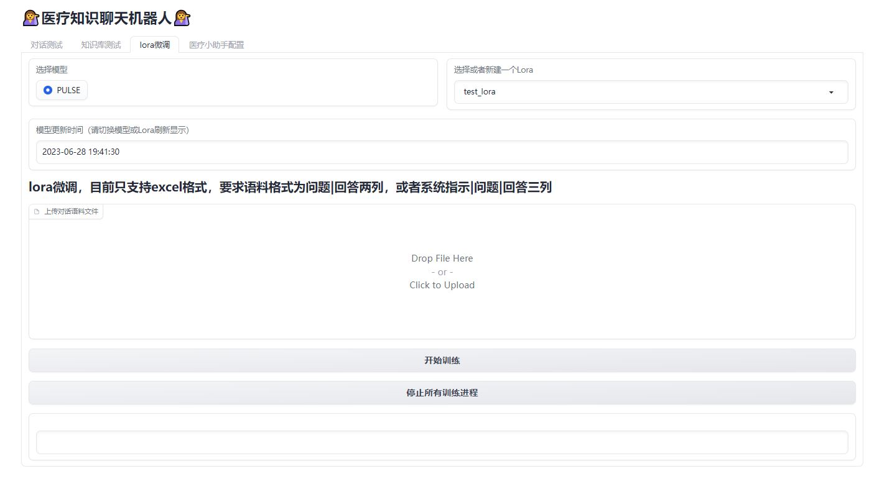
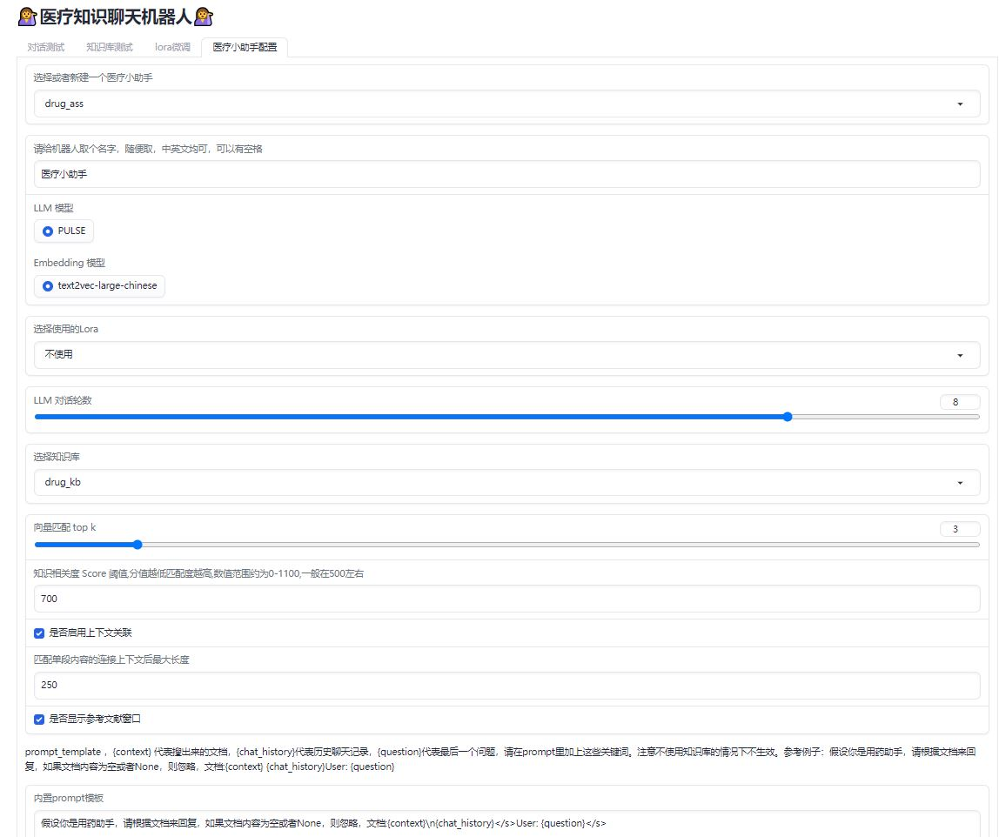
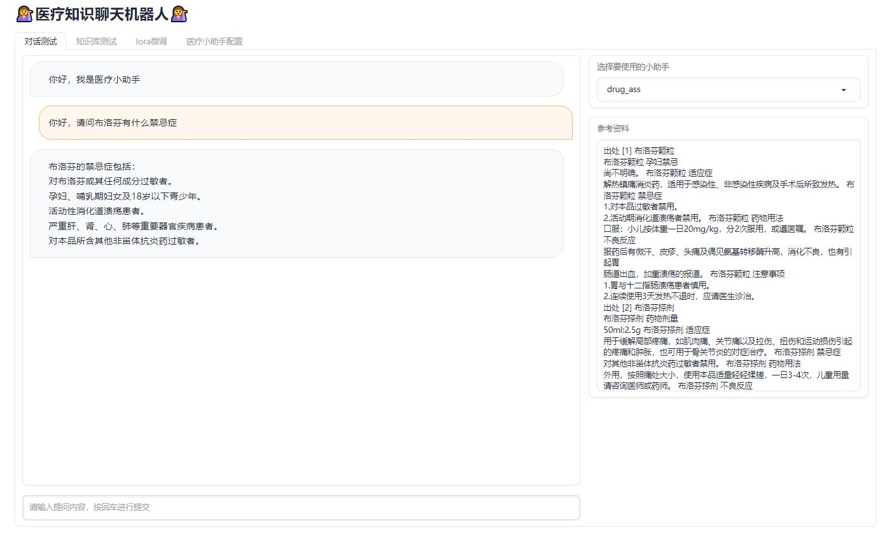

[[中文版](https://github.com/JuneYaooo/medical_kb_chatbot/blob/main/README.md)] [[English](https://github.com/JuneYaooo/medical_kb_chatbot/blob/main/README_en.md)]

# 医疗知识聊天机器人

欢迎使用 医疗知识聊天机器人，这是一款基于 PULSE 模型，引入知识库及微调训练的聊天机器人，旨在提供更实用的医疗相关功能和服务。用户可以自己添加相关知识库，进行模型微调，体验更丰富的应用场景：

## 你可以用它来做什么

- **药物查询**：提供药物数据库，用户可以搜索特定药物的信息，如用途、剂量、副作用等。

- **病症解释**：提供常见疾病、症状和医学术语的解释和定义，帮助用户更好地理解医学知识。

- **医疗客服**：添加相关医疗产品文档，支持用户与聊天机器人进行个性化对话，回答医疗产品相关问题，提供准确和可靠的信息。

## 使用方法

### 下载模型与修改配置文件

如果直接使用有问题，可以将PULSE模型下载到本地：https://huggingface.co/OpenMEDLab/PULSE-7bv5

然后在configs/common_config.py文件中将模型路径修改为本地路径，如修改embedding_model_dict和llm_model_dict中的路径即可。

### 安装

首先，克隆本项目到本地计算机：

```
git clone https://github.com/JuneYaooo/medical_kb_chatbot.git
```

#### 使用 pip 安装

确保您的计算机上已安装以下依赖项：

- Python 3.9
- pip 包管理器

进入项目目录并安装必要的依赖项：

```
cd medical_kb_chatbot
pip install -r requirements.txt
```

#### 使用 conda 安装

确保您的计算机上已安装以下依赖项：

- Anaconda 或 Miniconda

进入项目目录并创建一个新的 conda 环境：

```
cd medical_kb_chatbot
conda env create -f environment.yml
```

激活新创建的环境：

```
conda activate kb_chat
```

然后运行聊天机器人：

```
python app.py
```

### 使用说明
#### 可选择在知识库页面配置知识库
- 支持excel、json、非图片类型的pdf、word、txt等格式
- 其中excel、json需要按要求格式上传
- 鼓励挂载一些医疗知识库尝试效果，有好的案例欢迎分享
- 提供了一点点药品[demo数据](https://github.com/JuneYaooo/medical_kb_chatbot/blob/main/demo_data/kb_drug_demo.jsonl) ，可以下下来试一下




#### 可选择使用lora微调模型
- 微调目前最小需要24G显卡（~一张3090）
- 微调结束后，可看到更新时间
- 提供了一点点训练[demo数据](https://github.com/JuneYaooo/medical_kb_chatbot/blob/main/demo_data/lora_demo.xlsx) ，可以下下来试一下




#### 在医疗小助手页面选择配置自己的知识库聊天小助手（可自由选择是否使用某个知识库/微调的lora）
- 配置prompt可参考模板多尝试，有发现好的prompt欢迎分享
- prompt 设置可以参考如下格式
```
假设你是用药助手，请根据文档来回复，如果文档内容为空或者None，则忽略，文档:{context}\n{chat_history}</s>User:{question}</s>Helper:
```



#### 配置好小助手，来对话测试页面试试吧

- 选择一个已经配置好的聊天小助手，来体验一下吧



## 致谢

- [PULSE](https://github.com/openmedlab/PULSE): 本项目模型来源于PULSE
- [langchain-ChatGLM](https://github.com/imClumsyPanda/langchain-ChatGLM): 本项目知识库部分参考了langchain-ChatGLM的代码
- [BELLE](https://github.com/LianjiaTech/BELLE): 本项目Lora微调部分参考了BELLE的代码

## 贡献

如果您对该项目感兴趣，欢迎贡献您的代码和改进建议。您可以通过以下方式参与：

1. 提交问题和建议到本项目的 Issue 页面。
2. Fork 本项目并提交您的改进建议，我们将会审查并合并合适的改动。
