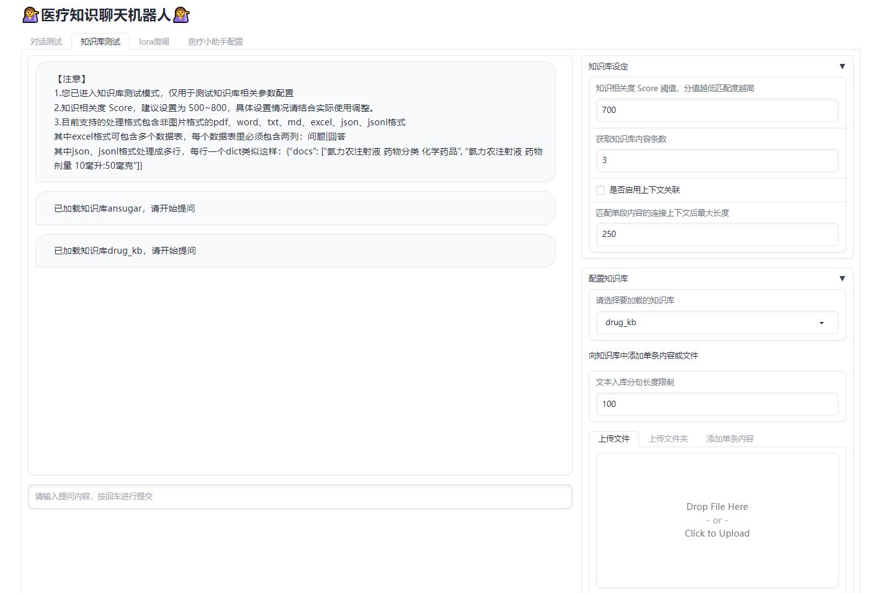
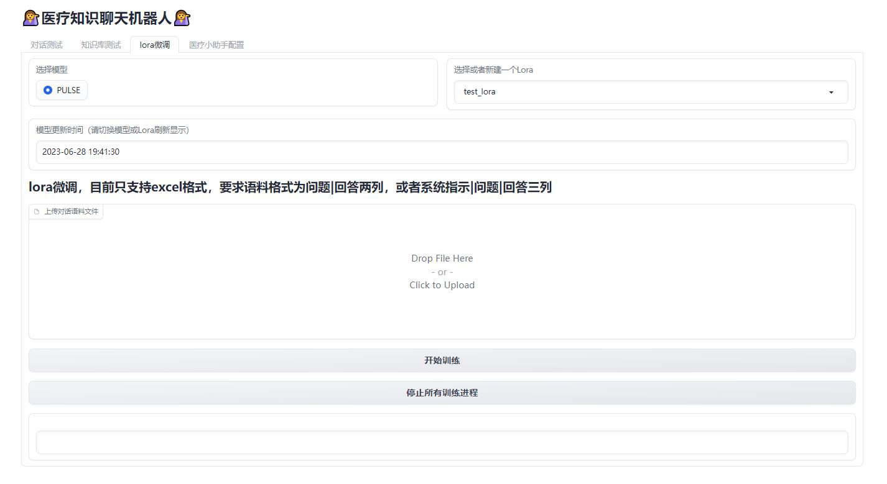
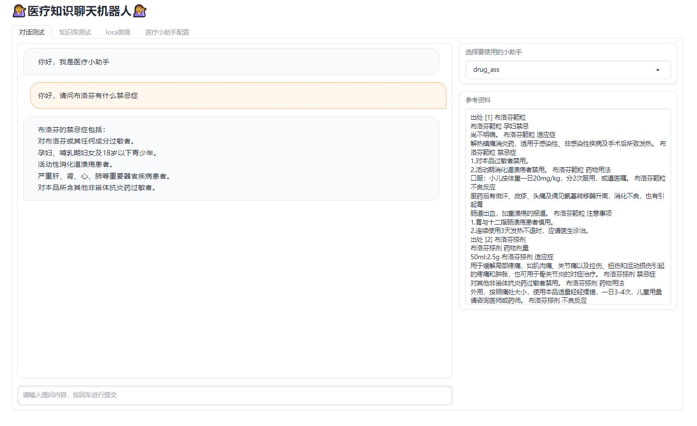

[[Chinese Version](https://github.com/JuneYaooo/medical_kb_chatbot/blob/main/README.md)]   [[English Version](https://github.com/JuneYaooo/medical_kb_chatbot/blob/main/README_en.md)]

# Medical Knowledge Chatbot

Welcome to the Medical Knowledge Chatbot. This is a chatbot based on the PULSE model, incorporating knowledge base and fine-tuning training, aiming to provide more practical medical-related functions and services. Users can add relevant knowledge bases and perform model fine-tuning to experience richer application scenarios.

## Example Applications of the Medical Chatbot

- **Drug Query**: Provides a drug database where users can search for specific drug information such as uses, dosage, side effects, etc.

- **Symptom Explanation**: Provides explanations and definitions of common diseases, symptoms, and medical terminologies to help users better understand medical knowledge.

- **Medical Customer Service**: Adds relevant medical product documentation, supports personalized conversations with the chatbot, answers questions related to medical products, and provides accurate and reliable information.

## Usage

### Download Model and Modify Configuration File

If there are any issues with direct usage, you can download the PULSE model to your local machine from: [https://huggingface.co/OpenMEDLab/PULSE-7bv5](https://huggingface.co/OpenMEDLab/PULSE-7bv5)

Then, modify the model path in the `configs/common_config.py` file to the local path. You can modify the paths in the `embedding_model_dict` and `llm_model_dict` variables.

### Installation

First, clone this project to your local machine:

```
git clone https://github.com/JuneYaooo/medical_kb_chatbot.git
```

#### Install using pip

Make sure the following dependencies are installed on your machine:

- Python 3.9
- pip package manager

Navigate to the project directory and install the necessary dependencies:

```
cd medical_kb_chatbot
pip install -r requirements.txt
```

#### Install using conda

Make sure the following dependencies are installed on your machine:

- Anaconda or Miniconda

Navigate to the project directory and create a new conda environment:

```
cd medical_kb_chatbot
conda env create -f environment.yml
```

Activate the newly created environment:

```
conda activate kb_chat
```

Then run the chatbot:

```
python app.py
```

### Instructions for Use

#### Configure Knowledge Bases on the Knowledge Base Page

- Supports formats such as Excel, JSON, non-image PDFs, Word documents, TXT files, etc.
- For Excel and JSON formats, they need to be uploaded in the required format.
- It is encouraged to mount some medical knowledge bases to try out the effectiveness. Good examples are welcome to be shared.



#### Fine-Tune the Model using Lora

- Fine-tuning currently requires a minimum of 24GB GPU (~one 3090).
- After fine-tuning, you can see the update time.



#### Configure Your Knowledge Base Chatbot on the Medical Chatbot Page (Optional to use a specific knowledge base/fine-tuned Lora)

- You can configure your own knowledge base chatbot by selecting whether to use a particular knowledge base or the fine-tuned Lora.
- Refer to the template for configuring prompts and try out different options. Good prompts are welcome to be shared.


#### Once the chatbot is configured, try it out on the conversation test page

- Select a pre-configured chatbot and give it a try.



## Acknowledgments

- [PULSE](https://github.com/openmedlab/PULSE): The model used in this project is based on PULSE.
- [langchain-ChatGLM](https://github.com/imClumsyPanda/langchain-ChatGLM): The code for the knowledge base part of this project was inspired by langchain-ChatGLM.
- [BELLE](https://github.com/LianjiaTech/BELLE): The code for the Lora fine-tuning part of this project was inspired by BELLE.

## Contribution

If you are interested in this project, you are welcome to contribute your code and improvement suggestions. You can participate in the following ways:

1. Submit issues and suggestions on the Issue page of this project.
2. Fork this project, make your improvements, and submit a pull request. We will review and merge appropriate changes.